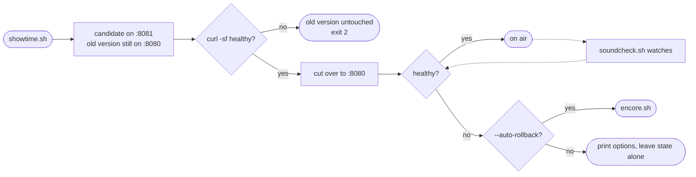

# soundcheck

[](https://github.com/iagorp6/soundcheck/actions/workflows/ci.yml)

Deploy a containerized service, prove it is actually healthy, and get a known-good
version back when it is not. Implemented twice on purpose: once by hand in Bash and
Docker, once again with Kubernetes primitives, so the second one is legible because
of the first.

```bash
./showtime.sh 1.2.0          # build, verify on a spare port, cut over
./soundcheck.sh --watch      # keep asking whether it is still healthy
./encore.sh 1.1.0            # put a specific earlier version back
```

## The story

This started as the level 1 exercise for Alura's SRE certification: a small Flask
app with `/health` and `/metrics`, three shell scripts, and a GitHub Actions
workflow that ran the tests. I passed it, and then I kept going, because the
exercise stopped exactly where the interesting questions start. What happens when
the last *two* deploys were bad? What does the deploy script do when the health
check fails at three in the morning? What is a health check even asserting?

It is still deliberately scoped to deploy, verify and roll back. It is not a
platform. That is what [`ensemble`](https://github.com/iagorp6/ensemble) is for,
and the boundary between the two is drawn on purpose rather than by accident.

The names come from live performance ops, extending the identity of my other two
repos. `radio-kiosk` is broadcast, `ensemble` is the full orchestra, and this one is
about keeping a show running:

| Original | Here | Why |
|---|---|---|
| `deploy.sh` | `showtime.sh` | Going live is the show starting |
| `monitor.sh` | `soundcheck.sh` | Continuously verifying it still sounds right |
| `rollback.sh` | `encore.sh` | Replaying a previous good performance |

## What I caught and fixed

The original `monitor.sh` checked health like this:

```bash
HEALTH=$(curl -s http://localhost:8080/health)
if [ $? -eq 0 ]; then  echo "Application is healthy"
```

while `deploy.sh`, in the same repo, checked it like this:

```bash
if curl -sf http://localhost:8080/health
```

One letter apart, and that letter is the whole point of a health check.

`-f` makes curl exit non-zero on an HTTP 4xx or 5xx. Without it, curl exits **0**
for an HTTP 500, because from curl's point of view the transfer succeeded
perfectly: it opened a connection, sent a request, and received a well-formed
response. curl's job is transport, and transport worked. Whether the body is a
stack trace is an application-level question it has no opinion about unless you
ask with `-f`.

So the monitor reported "healthy" for any service still up enough to serve an
error page, which is most of the outages you would actually want to hear about.
A crashed process it would catch, because connection refused is a transport
failure. A failed migration, a dead dependency, an unhandled exception: green.

Fixed in [`lib/common.sh`](lib/common.sh), and then made hard to reintroduce:

- CI greps for any `curl -s` without `-f`. There is exactly one legitimate
  exception, in [`soundcheck.sh`](soundcheck.sh), where the question really is
  "did the server answer at all, even with an error?", and it carries an explicit
  marker comment. The rule is that the exception has to be a decision someone
  wrote down, because an oversight looks identical.
- The app has a `HEALTH_FAIL=1` switch that makes `/health` return 503 while the
  process stays perfectly alive, and CI asserts against a real running container
  that `curl -s` succeeds against it and `curl -sf` does not. If that ever flips,
  the premise this repo is built on has changed and I want to know.

This is worth being upfront about rather than quietly fixing. Finding it, working
out why it mattered, and building the guard rail is more useful than never having
written it.

### And four more, in my own additions

I reviewed the extensions below by running them rather than reading them, and
found four defects. Two were in the headline feature, and the last one was found
by a test suite I wrote specifically because their absence was the gap.

**The alert rule could never fire.** `total_requests` only incremented on `/`.
Forty requests to `/health` and `/metrics/prometheus` produced a count of one, so
`sum(rate(soundcheck_requests_total[5m]))` sat at zero and the `> 0` guard I had
written into the rule made it permanently unfirable. An alert that cannot fire is
worse than no alert, because it reads as coverage. Fixed with a single
`@app.after_request` that counts everything except the scrape endpoints, plus a
bounded `route` label.

**A 404 returned 500 and counted as a service failure.**
`@app.errorhandler(Exception)` catches werkzeug's `HTTPException` too, so every
unknown URL became a server error. Inherited from the original, where nothing
read the numbers, and harmless right up until I built an alert on them: a handful
of mistyped URLs could take the success rate to zero. Fixed with a more specific
handler, and the alert now excludes unmatched routes.

**`--json-log` was silently ignored.** Flags are parsed before the config file is
sourced, so `config/retention.env` overwrote the flag's value, and the committed
`.example` sets `LOG_FORMAT`. Copying the example broke the flag with no error.
Fixed by giving flags their own precedence layer above the environment.

**A fourth, found by the shell test suite on its first run.** `soundcheck.sh`
falls back to `python3` when `jq` is missing. On Windows there is an App
Execution Alias at `WindowsApps/python3` that is not Python: it prints "Python
was not found; run without arguments to install from the Microsoft Store" **to
stdout** and exits 49. `command -v python3` finds it happily.

That combination is worse than a plainly missing command. The caller redirects
stderr and reads stdout, which is what pulling a field out of JSON looks like,
so it gets the advert text back as the value. `awk` then evaluates that
sentence as `0`, which is below any threshold. A missing interpreter would have
produced a false **alert** about a service that was completely fine. Fixed with
a `sc_python` helper that probes by running the thing and checking what comes
back, rather than trusting `PATH` or an exit code.

All four have regression tests. The lesson is the same one the `curl -sf` bug
teaches: none of them failed loudly. They failed by producing a plausible
number.

## Architecture

Full diagrams in [`docs/architecture.md`](docs/architecture.md). The short version:



## Enhancements beyond the original exercise

1. **Automatic or manual rollback, as a documented choice.** `--auto-rollback`
   makes a failed post-cutover health check call `encore.sh` itself; without it,
   the script prints the options and stops. Both are defensible, which is why it
   is a flag and not a default. Automatic recovers in seconds with nobody awake,
   and is also very good at hiding a problem: a deploy that fails, reverts, and
   reports success looks like nothing happened, and in a loop that is a service
   quietly stuck on an old version while the pipeline stays green. Manual keeps a
   human in the loop for the cases where rolling back is the wrong move, such as a
   schema migration that already ran. The genuinely bad option is having no
   opinion and leaving the operator to work out what state things are in.

2. **Rollback history deeper than one step.** The original kept a single
   `:previous` tag, so "the last two deploys were both bad" had no path back.
   Every version now keeps its own immutable tag, `RETENTION_COUNT` of them are
   retained (default 3, counting the one currently live, so two steps of
   rollback), and `./encore.sh 1.1.0` goes to a specific one.
   `./encore.sh --list` shows what is actually reachable, including which images
   retention has already pruned, because a rollback tool that cannot tell you
   what it can do is a coin flip.

3. **Structured logging.** Every deploy and rollback appends one JSON object per
   event to `deploy_history.log`: timestamp, action, tool, mode, version, result.
   The friendly coloured terminal output stays exactly as it was, and `--json-log`
   makes the terminal speak JSON too for when it is really a log collector. The
   file is what Promtail ships to Loki, which turns "when did 1.2.0 go out and did
   it work" into a query instead of a grep on whichever machine still has it.

4. **CI that checks the parts that are not Python.** shellcheck at `-S style` on
   every script, a 38-case shell unit suite for `lib/common.sh`, the
   health-check consistency rule above, pytest on 3.9 and 3.12,
   a real image build followed by starting it and asserting the endpoints and the
   Docker `HEALTHCHECK` respond, `promtool check rules` on the alert rules,
   `amtool check-config` on Alertmanager, and `kubeconform -strict` on the
   manifests. The original workflow ran the tests and echoed a tick, which proved
   the smallest part of the repo.

5. **A real observability stack, not just a compatible metrics format.** See
   below.

6. **Deploy pattern upgrades.** A Docker `HEALTHCHECK` in the Dockerfile, giving
   `docker ps` and anything built on Docker a native health verdict, alongside the
   external `curl -sf` the deploy script blocks on. They answer different
   questions: the internal one is "does the platform think this container is
   healthy", the external one is "can a client on the host actually reach it
   through the published port", and only the second one exercises the port
   mapping. Plus a blue-green deploy: the new version proves itself on 8081 while
   the old one is still serving 8080. The honest cost is a few seconds running two
   copies, and Docker cannot re-map a running container's published port, so the
   cutover recreates the verified image on 8080 rather than handing the port over
   live. Doing that properly needs a proxy in front, which is a load balancer,
   which is `ensemble`'s problem.

7. **Deploy history that the rollback tool reads.** `encore.sh` picks its target
   from the event log instead of blindly grabbing the last tag, and shows you the
   list before acting.

## Observability

`docker compose -f observability/docker-compose.yml up -d` brings up Prometheus,
Grafana, Loki, Promtail and Alertmanager next to the app.

- **Prometheus** actually scrapes and stores, rather than the app merely exposing
  a compatible format. That required a second endpoint: `/metrics` still returns
  the original JSON, because `soundcheck.sh` and the test suite parse it, and
  `/metrics/prometheus` returns the text exposition format, because Prometheus
  speaks exactly one wire format and JSON is not it. `metrics_path` in a scrape
  config exists precisely so you can add an endpoint instead of breaking one.
- **Grafana** gets one dashboard, provisioned from
  [a JSON file](observability/grafana/dashboards/soundcheck.json), not built by
  clicking. UI edits are disabled on purpose. A dashboard someone tweaked at 2am
  that exists only in Grafana's database cannot be reviewed, diffed or restored.
- **Loki and Promtail** ingest `deploy_history.log` and the app's container
  stdout, so `{job="deploy-history", result="failure"}` is a real query.
- **Alertmanager** receives the rules Prometheus evaluates. The important one
  replaces the shell script's hardcoded `success_rate < 95%` with the version
  that actually works:

  ```promql
  sum(rate(soundcheck_requests_total{result="success",route!="<unmatched>"}[5m]))
    / sum(rate(soundcheck_requests_total{route!="<unmatched>"}[5m])) * 100 < 95
  ```

  Two label decisions in there worth stating. The `route` label carries the
  matched *route pattern*, never the raw path, so a scanner hitting a thousand
  URLs produces one series instead of a thousand: request paths are the most
  common way to blow up Prometheus by accident. And 404s are excluded from
  this particular question, because someone typing a bad URL is not the
  service failing, and an alert that pages on that gets muted within a week.
  They are still counted and still visible, just not here.

  Health checks *are* counted, and Prometheus scrapes are not. That pairing is
  deliberate: probes are the one kind of traffic an idle service is guaranteed
  to have, so they keep the denominator alive, while a scrape every ten
  seconds forever would be a constant background rate that dilutes everything
  real.

  The app's `success_rate_percent` is a lifetime average since process start.
  After a week of uptime, ten minutes of failing every single request barely
  moves it, because the denominator is a week of successes. A threshold on a
  lifetime average is a smoke alarm that averages the temperature since you moved
  in. `rate()` over five minutes reacts to what is happening now, which is the
  reason Prometheus stores counters and lets the query pick the window.

  The shell check stays anyway. It needs nothing but curl and works when the
  stack is not running.

Nothing is actually delivered anywhere: there is no Slack workspace or SMTP
server behind this repo, and configuring a fake one would be decoration. The
routing, grouping and inhibition logic is real and does run, firing alerts are
visible in the Alertmanager UI, and the commented example shows the one block
that would make it deliver.

**Why this lives here at all, given `ensemble` has a `metronome` layer running the
same four components:** this repo runs them small, self-contained, for one app,
with every config file written out by hand so the mechanism is visible.
`ensemble` runs them as Helm releases reconciled by ArgoCD across a cluster.
Same components, deliberately different scale and delivery. The line I am not
crossing here is GitOps.

## Kubernetes-native mode

Enhancements 1 to 7 hand-roll deploy, monitor and rollback to understand the
fundamentals. This mode re-implements the same discipline with Kubernetes
primitives, to show what an orchestrator does underneath rather than just that I
can type `kubectl`.

```bash
kind create cluster --config k8s/kind-cluster.yaml
./showtime.sh 1.2.0 --k8s     # apply, set image, kubectl rollout status
./soundcheck.sh --k8s         # pod readiness, restart counts
./encore.sh --k8s             # kubectl rollout undo
```

The thing worth noticing is what disappears. The `curl` retry loop is gone,
because `kubectl rollout status` blocks until the new ReplicaSet reports Ready,
and Ready means the `readinessProbe` passed. Same check, moved from my script
into the control loop that owns the Pods. The blue-green dance is gone too:
`maxUnavailable: 0` with `maxSurge: 1` will not remove an old Pod until a new one
is Ready, which is what the candidate-on-8081 routine was emulating by hand.

[`k8s/deployment.yaml`](k8s/deployment.yaml) carries the long version of the probe
distinction, which is the part people most often get wrong:

- **readiness** asks "should this Pod get traffic right now?" Failing it removes
  the Pod from the Service endpoints. Nothing is killed. Correct for warm-up or a
  dependency being briefly away.
- **liveness** asks "is this process beyond saving?" Failing it kills the
  container. The only correct answer to it is "restarting will help".

Point a liveness probe at an endpoint that touches the database, have the
database wobble for ten minutes, and the cluster restarts every Pod, which come
back cold and hammer the recovering database. A degradation becomes an outage,
caused entirely by the probe. Readiness would have handled it correctly.

**The boundary with `ensemble`, stated plainly:** this mode is imperative and
local. `kubectl apply`, `kubectl rollout`, on a Kind cluster that runs entirely
on my laptop with no cloud account. `ensemble` is declarative and remote: ArgoCD
watching a Git repo, on K3s on an Oracle Cloud VM. Same underlying tool,
deliberately different skill. There is no ArgoCD here and there will not be, because
that would duplicate `ensemble`'s `conductor` layer instead of complementing it.
Kind rather than K3s for the same reason: two genuinely different setups, not one
cluster reused across two repos.

## Setup

Needs Docker, curl and bash 4.4 or newer. `jq` is used when present and not
required. Kubernetes mode additionally needs `kind` and `kubectl`; the Helm
observability path needs `helm`.

```bash
git clone https://github.com/iagorp6/soundcheck && cd soundcheck
cp config/retention.env.example config/retention.env   # optional, defaults work
```

Both suites run without Docker and without installing anything:

```bash
pytest tests/            # the app
./tests/test_common.sh   # the shell, no bats required
```

**Docker mode**

```bash
./showtime.sh 1.0.0                    # first deploy
./soundcheck.sh                        # one health sweep
./soundcheck.sh --watch 10             # keep sweeping
./showtime.sh 1.1.0 --auto-rollback    # deploy, revert automatically if it fails
./encore.sh --list                     # what can I roll back to?
./encore.sh 1.0.0                      # go there
```

**See the bug for yourself**

```bash
docker run -d --name broken -p 8082:8080 -e HEALTH_FAIL=1 soundcheck-app:1.0.0
curl -s  http://localhost:8082/health >/dev/null; echo "curl -s  exit: $?"   # 0
curl -sf http://localhost:8082/health >/dev/null; echo "curl -sf exit: $?"   # 22
docker rm -f broken
```

**Observability**

```bash
docker compose -f observability/docker-compose.yml up -d
```

Grafana on :3000 (admin/admin), Prometheus on :9090, Alertmanager on :9093.
Bring the stack up before deploying anything and Prometheus will show the target
as down, which is the truth.

**Kubernetes mode**

```bash
kind create cluster --config k8s/kind-cluster.yaml
./showtime.sh 1.0.0 --k8s
kubectl -n soundcheck port-forward svc/soundcheck 8080:80
./k8s/observability/install.sh          # same dashboard and rules, via Helm
kind delete cluster --name soundcheck   # complete cleanup
```

`showtime.sh --k8s` applies the namespace, ConfigMap, Deployment and Service.
The HPA is deliberately left out of that list and applied by hand, because it
needs metrics-server, which Kind does not ship, and a deploy script that
silently creates objects that cannot work is worse than one that leaves them
to you:

```bash
kubectl -n soundcheck apply -f k8s/hpa.yaml
```

Note also that `RETENTION_COUNT` prunes the *local* Docker image store and has
no effect on what the cluster keeps. Rollback depth in Kubernetes is
`revisionHistoryLimit` in [`k8s/deployment.yaml`](k8s/deployment.yaml), set to
5. Two mechanisms, two numbers; one config key pretending to control both
would be tidier and untrue.

`install.sh` loads the same dashboard JSON and the same alert rules the Compose
stack uses, rather than a second copy that drifts. The dashboard goes in as a
ConfigMap labelled `grafana_dashboard=1` for Grafana's sidecar to pick up, and
the rules work because a `PrometheusRule` spec is a top-level `groups:` list,
exactly like the native rules file, so the conversion is a two-space indent.

## Status

Two suites pass: 17 pytest cases (up from 4) and 38 shell cases for
`lib/common.sh`. Every config file is validated in CI. A good share of those are
regressions for the four bugs described above, which is the part I would want to
be judged on: the fixes are pinned, not just made.

The shell suite earns its place. It found the fourth bug on its first run, on
the machine it was written on, in a code path that only misbehaves when `jq` is
absent and Windows is present. That is exactly the kind of thing reading the
code does not catch.

The end-to-end Docker and Kind flows are written and reviewed but I have not yet
recorded a clean run of them on this machine, and I would rather say that than
imply otherwise.

## What I learned

**A health check is an assertion, and you have to know which one.** `curl -s` and
`curl -sf` differ by one letter and assert completely different things. Same for
readiness and liveness in Kubernetes, which point at the identical URL and mean
opposite things about what should happen when it fails.

**Where you discover a failure decides what it costs.** Stop-then-start finds out
the new version is broken at the exact moment there is no working version left.
Blue-green finds out while the old one is still serving. The check is the same;
the ordering is everything.

**A cumulative percentage is not a monitoring signal.** The lifetime success rate
was the thing I would have shipped without thinking about it. Writing the
`rate()` version next to it made the problem obvious, and made me understand why
Prometheus exports counters and refuses to compute the average for you.

**The orchestrator is doing what I just wrote, with better failure handling.**
`kubectl rollout status` was a black box until I had written the retry loop it
replaces. Doing it by hand first is what made the Kubernetes version readable
instead of magic.

**A number that looks reasonable is the most dangerous failure mode.** All four
bugs in this repo, the original one and the three I introduced, produced
plausible output. A "healthy" that meant HTTP 500, a success rate of 100% from
a single request, a 500 that was really a 404, a flag that appeared to work.
None of them threw. That is why the guard rails here are tests and CI checks
rather than comments saying to be careful.

## What is next

- A load generator, so the alert rule, the dashboard and the HPA have real
  traffic to react to instead of a synthetic switch.
- Actually run both flows end to end and put the output in here.
- The `metronome` bridge: this repo's Prometheus rules and dashboard are the
  single-service version of what `ensemble` runs at cluster scale. Keeping them
  genuinely shared rather than merely similar is the interesting part.

## License

MIT. See [LICENSE](LICENSE).
