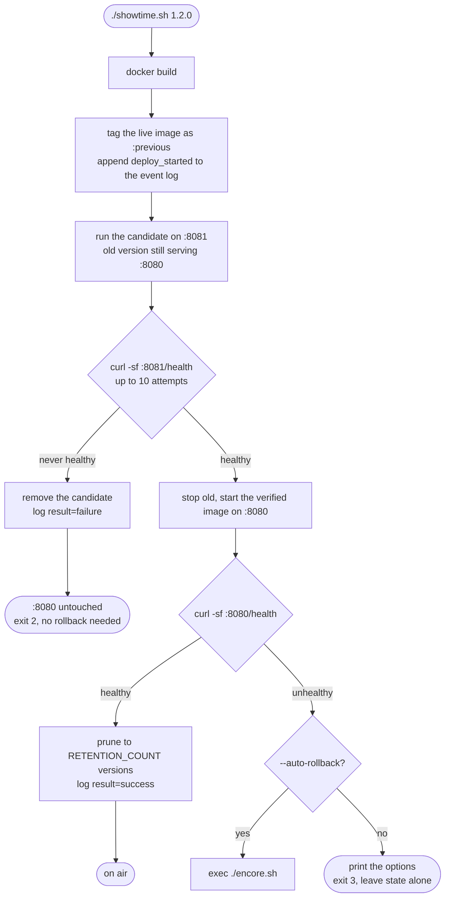
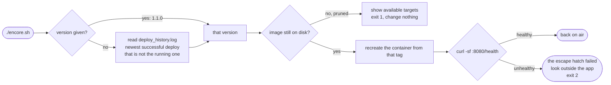
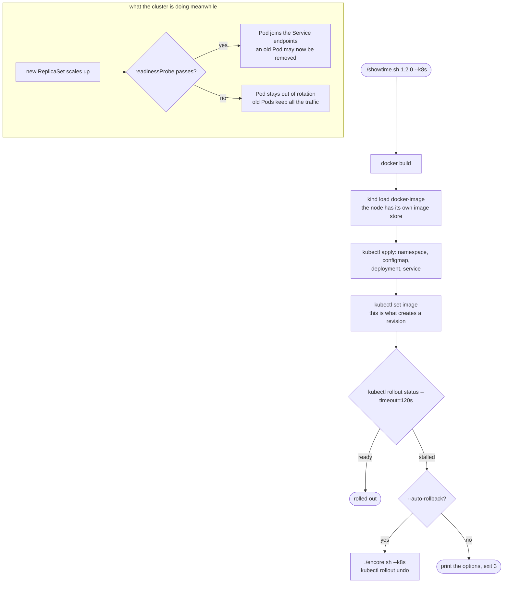
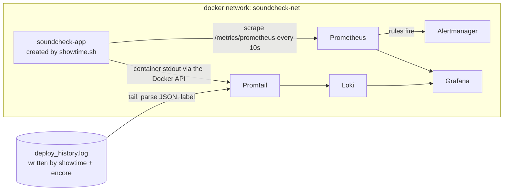

# Architecture

Three scripts, one service, two ways of running it. This document is the map;
the reasoning behind each decision lives in the comments of the file it
belongs to.

## The pieces

| File | Role |
|---|---|
| [`showtime.sh`](../showtime.sh) | Build a version, prove it healthy, put it on air |
| [`soundcheck.sh`](../soundcheck.sh) | Keep asking whether it is still healthy |
| [`encore.sh`](../encore.sh) | Put a known-good earlier version back |
| [`lib/common.sh`](../lib/common.sh) | Config, the two output channels, the event log |
| [`app/`](../app) | The Flask service being deployed |
| [`observability/`](../observability) | Prometheus, Grafana, Loki, Alertmanager, via Compose |
| [`k8s/`](../k8s) | The same story told with Kubernetes primitives |

## Docker mode: the blue-green deploy

The important property is where the failure is discovered. The candidate has
to prove itself on port 8081 while the old version is still answering on 8080,
so a bad build costs a build and nothing else.

The two failure paths are deliberately different. A candidate that never comes
up is not an incident, because nothing was taken away from anyone. A failure
after the cutover is one, and it is the only place the automatic-versus-manual
rollback question actually arises.

## The rollback path

`encore.sh` reads the event log rather than trusting a single `:previous`
tag, which is what lets it go back more than one step and tell you in advance
what is reachable.

## Kubernetes mode

Same three beats, handed to the orchestrator. The retry loop disappears
because `kubectl rollout status` blocks on the readiness probe, and the
blue-green dance disappears because `maxUnavailable: 0` already refuses to
remove an old Pod before a new one is Ready.

`kubectl rollout undo` is literally an encore: it replays a revision the
cluster already has, rather than building anything new.

## Where the two modes differ, and why that is the point

| | Docker mode | Kubernetes mode |
|---|---|---|
| Wait for healthy | `curl -sf` retry loop in the script | `kubectl rollout status` |
| Health definition | external probe from the host | `readinessProbe` + `livenessProbe` |
| Keep the old version alive | candidate on a second port | `maxUnavailable: 0`, `maxSurge: 1` |
| Rollback source | image tags plus `deploy_history.log` | old ReplicaSets, `revisionHistoryLimit` |
| Rollback command | `./encore.sh 1.1.0` | `kubectl rollout undo` |
| Who reruns the health check | nobody, it runs once per deploy | the kubelet, forever |

Enhancements 1 to 7 exist to make that right-hand column legible. It is much
easier to trust `rollout status` after having written the loop it replaces.

## Observability data flow

Two independent lifecycles joined by one Docker network. The app is created
and destroyed by `showtime.sh`; the stack is created and destroyed by
`docker compose`. Neither can take the other down by accident.

The `soundcheck-app` name is a network alias, not a hostname anyone
configured. Every deploy destroys the container behind it and the name keeps
resolving, which is service discovery in its simplest honest form.

### The two success-rate checks

Both exist on purpose and they are not equivalent.

| | `soundcheck.sh` | `alert_rules.yml` |
|---|---|---|
| Reads | `success_rate_percent`, a lifetime average | `rate(soundcheck_requests_total[5m])` |
| Reacts in | never, on a long-lived process | about five minutes |
| Needs | curl | a running Prometheus |
| Is | the torch in the drawer | the lighting rig |

After a week of uptime, ten minutes of total failure barely moves a lifetime
average, because the denominator is a week of successes. That is why the
Prometheus rule is the one that should page anyone, and why the shell check is
still worth keeping: it works when nothing else is running.

## Relationship to the other repos

- [`radio-kiosk`](https://github.com/iagorp6/radio-auto-pi) is broadcast: one
  device, kept on air by a watchdog. `station.conf` there and
  `config/retention.env` here are the same config-and-data instinct.
- **`soundcheck`** (this repo) is one service, deployed and watched by hand,
  then again by an orchestrator.
- [`ensemble`](https://github.com/iagorp6/ensemble) is the whole platform:
  Terraform, Ansible, K3s on a cloud VM, ArgoCD reconciling Git, and a
  `metronome` layer running this same Prometheus/Grafana/Loki/Alertmanager
  set at cluster scale.

The overlap with `metronome` is intentional and bounded. This repo runs that
stack small, self-contained, for one app, with the config written out by hand
so the mechanism is visible. `ensemble` runs it as Helm releases reconciled by
ArgoCD across a cluster. Same four components, deliberately different scale
and delivery method. Nothing here should grow into GitOps; that boundary is
what keeps the two repos from being the same project twice.
